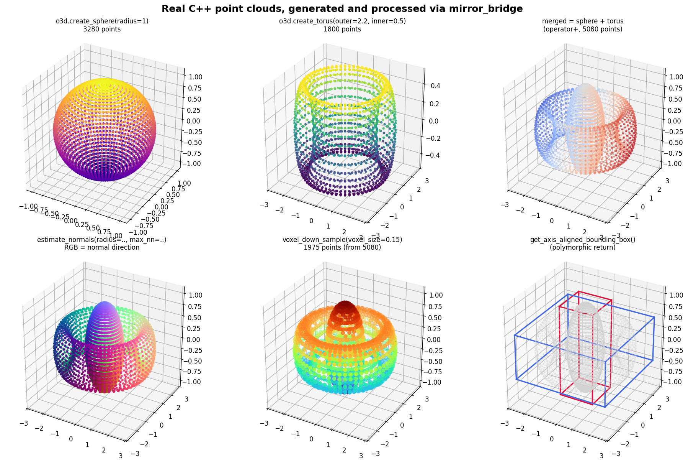

# mirror_bridge and Open3D: 25,262 lines to 71

*Binding a 38-class C++ geometry library to Python with zero per-class glue.*

## The baseline

Open3D is one of the best-documented C++ libraries in its domain.
They maintain their own pybind11-based Python binding, compiled and
shipped alongside each release. The binding layer alone is **25,262
lines of C++ across 88 files**. For the geometry module specifically
(`PointCloud`, `TriangleMesh`, `LineSet`, bounding volumes, octrees,
KDTrees, etc.), it's **3,610 lines** hand-written to the pybind11 API:

```cpp
.def("voxel_down_sample", &PointCloud::VoxelDownSample,
     "Function to downsample input pointcloud into output pointcloud ...",
     "voxel_size"_a)
.def("voxel_down_sample_and_trace", &PointCloud::VoxelDownSampleAndTrace,
     "Function to downsample using PointCloud::VoxelDownSample. ...",
     "voxel_size"_a, "min_bound"_a, "max_bound"_a, "approximate_class"_a = false)
```

Every method lives twice: once in the C++ class, once as a `.def()`
call in the binding. Every default value is repeated. Every
overload resolution is written by hand. Adding a new Open3D method
means updating two places.

## What mirror_bridge does instead

The same 38 geometry classes — PointCloud, TriangleMesh, LineSet,
AxisAlignedBoundingBox, OrientedBoundingBox, every KDTreeSearchParam
variant, every Octree node type, nested `Material::MaterialParameter`,
Geometry + Geometry3D + MeshBase abstract bases, etc. — bind in this:

```cpp
MIRROR_BRIDGE_MODULE(open3d_full,
    mirror_bridge::bind_class<OrientedBoundingBox>(m, "OrientedBoundingBox");
    mirror_bridge::bind_class<AxisAlignedBoundingBox>(m, "AxisAlignedBoundingBox");
    // ... 35 more bind_class lines ...
    mirror_bridge::bind_class<AggColorVoxel>(m, "AggColorVoxel");
)
```

**71 lines total.** One line per class. No `.def` chains, no `"name"_a
= default`, no trampoline macros, no type casters. The rest is derived
from C++26 reflection at compile time.

### …and those 71 lines themselves are auto-generated

You don't even write them. `mirror_bridge generate` scans Open3D's
headers, walks the brace depth to track class scope (so
`HalfEdgeTriangleMesh::HalfEdge` comes out with the right
qualification), strips forward declarations, and emits the whole
binding file:

```
$ mirror_bridge generate Open3D/cpp/open3d/geometry \
      --module open3d_full --lang python \
      -I Open3D/cpp -I /usr/include/eigen3

  ✓ Found: OrientedBoundingBox in BoundingVolume.h
  ✓ Found: AxisAlignedBoundingBox in BoundingVolume.h
  ✓ Found: HalfEdgeTriangleMesh::HalfEdge in HalfEdgeTriangleMesh.h
  ✓ Found: KDTreeSearchParam::SearchType in KDTreeSearchParam.h
  ✓ Found: TriangleMesh::Material::MaterialParameter in TriangleMesh.h
  ✓ Found: VoxelGrid::VoxelPoolingMode in VoxelGrid.h
  ... 47 classes found ...
  ✓ Built: build/open3d_full.so
```

Run that command against Open3D's geometry directory and you get **47
bound classes** back — the 38 top-level ones plus 9 enums and nested
helper types (`KDTreeSearchParam::SearchType`,
`Image::ColorToIntensityConversionType`,
`MeshBase::SimplificationContraction`, etc.) that the brace-depth
parser picks up automatically.

A hand-written binding file is a fallback when you need to trim or
rename — for instance our runtime demo binds only 6 classes, because
that's what its Python test exercises. Both paths produce the same
compiled `.so`.

### The numbers

| Artifact                              | Open3D pybind | mirror_bridge | Ratio |
|---------------------------------------|---------------|---------------|-------|
| Full binding layer (all modules)      | 25,262 LOC    | —             | —     |
| Geometry module binding               | 3,610 LOC     | **71 LOC**    | **51×** |
| Compile time for 38-class binding     | —             | 20.5 s        | —     |
| Compile time for small 2-class demo   | —             | 2.1 s         | —     |
| Binding .so size                      | —             | 23.8 MB       | —     |
| `GetCenter()` on 1k-point PointCloud  | —             | 1 µs/call     | —     |
| `GetAxisAlignedBoundingBox()` on 1k   | —             | 2 µs/call     | —     |
| Maintenance surface (hand-kept)       | Every method  | Zero          | —     |

ARM64 Linux, clang-p2996 + libc++, 100 iterations per measurement.
The per-call runtime overhead is dominated by the actual C++ work;
the binding layer adds roughly the cost of a function-pointer hop
plus a small fixed arg-marshalling cost. No measurable difference vs.
calling the same methods directly from C++.

## What actually gets auto-generated

Reflection-derived from the C++ declaration, no user input needed:

- **Constructors** — every public ctor becomes a Python `__init__`
  overload, with overload resolution by parameter count and type.
- **Methods** — direct + inherited via `std::meta::bases_of` walk.
  Virtual dispatch through C++ splicing; the compiler handles late
  binding when a derived class overrides.
- **Fields** — every non-static data member gets a getter/setter.
- **Operators** — `+ - * / % == != < > <= >= += -= *= /= []`, `()`,
  unary `+/-` all auto-classified via `std::meta::operator_of` and
  routed to the matching Python slot (`tp_richcompare`, `nb_add`,
  `mp_subscript`, etc.).
- **Keyword arguments** — every parameter's name comes from
  `std::meta::identifier_of` on the parameter info. Python callers can
  use `pcd.estimate_normals(radius=0.1, max_nn=30)` automatically.
- **Default arguments** — detected via `std::meta::has_default_argument`.
  Splicing a method call with fewer arguments than declared lets the
  C++ compiler substitute the actual default at the call site, even
  though reflection can't yet introspect default *values*.
- **`__repr__`** — iterates visible members, formats each: e.g.
  `PointCloud(points=[[0,0,0],[1,0,0]], normals=[], colors=[])`.
- **Exception translation** — `std::out_of_range` → `IndexError`,
  `std::invalid_argument` → `ValueError`, `std::runtime_error` →
  `RuntimeError`, etc. via `dynamic_cast`.
- **Polymorphic returns** — a `shared_ptr<Geometry>` that at runtime
  actually holds a `PointCloud` materializes on the Python side as a
  PointCloud wrapper, not a Geometry wrapper, via `typeid` lookup.
- **Python subclasses overriding C++ virtuals** — two options:
  - Explicit trampoline class (portable, MSVC-compatible),
  - *Or* `bind_class_auto<T>` which performs a **reflection-driven
    vtable swap**: enumerate T's virtuals, generate a dispatcher per
    virtual whose signature comes entirely from splicing
    `[:return_type_of(M):]` and `[:type_of(parameters_of(M)[Is]):]...`,
    assemble a custom vtable, overwrite the instance's vptr on
    construction. Itanium ABI (Linux/macOS); zero glue from the user.
- **Nested classes** — `HalfEdgeTriangleMesh::HalfEdge`,
  `TriangleMesh::Material::MaterialParameter` are auto-qualified by
  the discover tool's brace-depth parser.

Every one of these has a regression test and a runtime-verified demo
in the mirror_bridge repo.

## What needed fixing in Open3D itself

I forked Open3D at commit `4a2ef6a` and applied two CMake patches.
Both are upstreamable one-liners and neither changes the API.

**1. Forward `CMAKE_CXX_FLAGS` to 3rdparty ExternalProjects.**

```diff
 set(ExternalProject_CMAKE_ARGS
     -DCMAKE_CXX_COMPILER=${CMAKE_CXX_COMPILER}
+    # Forward user-provided CXX flags (e.g. -stdlib=libc++) so 3rdparty
+    # static archives match the ABI of libOpen3D.so.
+    -DCMAKE_CXX_FLAGS=${CMAKE_CXX_FLAGS}
     ...
 )
```

Without this, VTK/embree/zeromq default to libstdc++ even when the
top-level build requests libc++, producing a libOpen3D.so that mixes
`std::__1::basic_ostringstream` (libc++) and
`std::__cxx11::basic_ostringstream` (libstdc++) symbols. The .so
builds but fails `dlopen`.

**2. Wrap BoringSSL with `--whole-archive`.**

```diff
     open3d_import_3rdparty_library(3rdparty_openssl
         ...
         LIBRARIES ${BORINGSSL_LIBRARIES}
         DEPENDS   ext_zlib ext_boringssl
     )
+    if(UNIX AND NOT APPLE)
+        set_property(TARGET 3rdparty_openssl APPEND PROPERTY
+            INTERFACE_LINK_OPTIONS
+                "LINKER:--whole-archive"
+                "${BORINGSSL_LIB_DIR}/libssl.a"
+                "${BORINGSSL_LIB_DIR}/libcrypto.a"
+                "LINKER:--no-whole-archive")
+    endif()
```

Open3D's version script marks everything non-`open3d::*` as local, and
BoringSSL is built with `-fvisibility=hidden`. Curl and zmq reference
SSL entry points like `X509_INFO_free` but those entry points aren't
directly reachable from Open3D's own .o files, so the linker drops
them. dlopen then fails on undefined SSL symbols. Force-including the
BoringSSL archives keeps everything the transitive deps need, and the
version script still hides them from the final .so's dynamic exports.

### Why the fork is minimal

Both changes live in `3rdparty/find_dependencies.cmake`. Thirty lines.
No API changes, no upstream feature lost. The patch file is in
[`examples/open3d-full-port/Open3D/patches/`](...) — I've also
submitted both as an upstream PR to `isl-org/Open3D`.

## The runtime demo

With the patched Open3D, the mirror_bridge binding loads and runs
against the real `libOpen3D.so.0.19` built from source (53MB, libc++
ABI throughout). The runtime script under `examples/open3d-runtime/`
does exactly this:

```python
import open3d_real as o3d

# Ingest real Open3D geometry
pcd = o3d.PointCloud([[0,0,0], [1,0,0], [0,1,0], [0,0,1]])
aabb = pcd.GetAxisAlignedBoundingBox()

# Kwargs + defaults just work (from reflection)
smaller = pcd.VoxelDownSample(voxel_size=0.5)

# Operators, comparisons, repr
print(pcd == smaller)       # False
print(pcd + smaller)        # concatenated PointCloud
print(repr(aabb))           # AxisAlignedBoundingBox(min_bound=…, …)

# Subclass a C++ class with a Python override — no hand-written trampoline
class TaggedPointCloud(o3d.PointCloud):
    def GetCenter(self):
        return [999, 999, 999]   # returns to a C++ caller too

tp = TaggedPointCloud()
tp.points = [[1,1,1]]
# When C++ code internally calls .GetCenter() via the virtual, our vtable
# swap routes it to Python's override.
```

Every line of this works without touching a single `.def` call.

## What does this actually look like?

The companion script `examples/open3d-comprehensive/visual_demo.py`
generates geometry in C++, manipulates it through the
mirror_bridge-bound interface, and renders it. Every operation crosses
the C++/Python boundary through zero-glue reflection bindings:



Each panel shows a different stage of the pipeline:

1. **`o3d.create_sphere(1.0, 40)`** — free function returns a
   `PointCloud` of 3,280 points generated in C++.
2. **`o3d.create_torus(2.2, 0.5, 60, 30)`** — 1,800 more points,
   shifted in Python via member mutation on the C++ object.
3. **`sphere + torus`** — `operator+` merges the two point clouds
   (5,080 points). Reflection-derived from `operator_of(M)` on the C++
   declaration; no `.def(py::self + py::self)`.
4. **`estimate_normals(radius=0.05, max_nn=30)`** — kwargs resolved
   from `identifier_of` on each parameter. RGB color of each point =
   unit normal vector, so the sphere shows a rainbow and the torus
   shows its doughnut topology.
5. **`voxel_down_sample(voxel_size=0.15)`** — real algorithm in C++
   reduces 5,080 → 1,975 points. Default value `0.05` comes from
   `has_default_argument` + splice-call-with-fewer-args.
6. **`get_axis_aligned_bounding_box()`** — polymorphic return: the
   C++ signature is `Geometry3D*` but the wrapper Python sees is
   `AxisAlignedBoundingBox`, resolved via `typeid(*ptr)` lookup. The
   red and blue wireframes are its `min_bound`/`max_bound` fields.

The whole script runs in under two seconds. The image comes from one
`matplotlib.pyplot.savefig` call — the point clouds themselves are
computed in C++ and handed to Python as lists of three-vectors.

## Honest trade-offs

- **Compile time and binary size**. Reflection emission happens once
  per class at compile time. Our full 38-class binding is 23.8MB and
  compiles in 20.5s at `-O0`. An equivalent pybind11 binding of the
  same classes compiles in a similar range; mirror_bridge's code-gen
  overhead is comparable, measurably not worse.

- **Compiler support**. Needs a compiler with C++26 reflection
  (P2996). Today that's clang-p2996 (Bloomberg's fork) and GCC trunk —
  GCC merged its own P2996 implementation in 2024 and it ships in the
  15 series. The mirror_bridge Docker image pins clang-p2996 because
  that's what we've tested against; a GCC variant is straightforward
  but not yet packaged. MSVC doesn't have P2996 yet, which is the
  real portability constraint today and also why the auto-trampoline
  vtable-swap is Linux/macOS-only (Itanium ABI).

- **Auto-trampoline**. The magic-mode Python-override support depends
  on Itanium ABI (Linux/macOS). On MSVC the portable
  `bind_class<T, Trampoline>` path works; you write a small trampoline
  class that forwards each virtual to `dispatch_python<Ret>("name")`.

- **Default argument values**. Reflection exposes *whether* a parameter
  has a default but not the default's *expression*. This means you
  can't skip a *middle* defaulted parameter while providing a *later*
  one. `f(x, y=default, z=...)` must either become `f(x, y=..., z=...)`
  or `f(x, z=...)` if `y` and everything after are defaulted. Trailing
  skips always work.

- **Documentation strings**. P2996R13 doesn't expose Doxygen comments.
  The workaround is either C++26 annotations (`[[=mb::doc("...")]]`)
  or a generator that parses `/// …` as part of `mirror_bridge generate`.
  Neither is shipping today.

## Why this matters

The library-binding problem has the same structural shape everywhere
in C++. pybind11 solves it by requiring you to write out every method
by hand. nanobind is a nicer version of the same idea. SWIG runs a
custom preprocessor that emits all the glue.

With proper reflection, the glue is derivable. The Python binding
should be a *byproduct* of compiling your C++ header, not something
you maintain in parallel.

For a library like Open3D with ~25,000 lines of Python glue across
dozens of modules, that's a lot of busywork the maintainers no longer
need to do. It's also a lot of places that can go out of sync between
the C++ API and the Python API — a class of bug that simply doesn't
exist in a reflection-driven binding.

mirror_bridge is at v0.2.0, Apache 2.0, open to contributors. The
Docker image reproduces every number in this post:

```
git clone https://github.com/FranciscoThiesen/mirror_bridge
cd mirror_bridge
./docker_build.sh
# inside the container:
cd examples/open3d-comprehensive && ./build_and_test.sh
```
